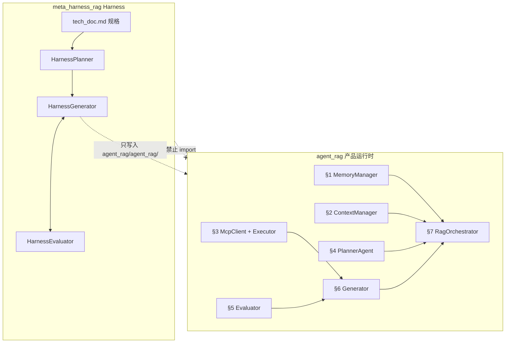

# 双系统架构（Harness vs RAG 产品）

`tech_doc.md` 描述 **RAG 产品**规格；**Harness**（`meta_harness_rag/`）把规格**落地到**同级目录 **`agent_rag/`**。二者 **全部模块分离**。

## 目录对照表

| tech_doc | RAG 产品（`agent_rag/agent_rag/`） | Harness（`meta_harness_rag/harness/`） |
|----------|-----------------------------------|----------------------------------------|
| §1 | `memory/memory_manager.py` | — |
| §2 | `context/context_manager.py` | — |
| §3 | `mcp/mcp_client.py`, `executor.py` | — |
| §4 | `agents/planner.py` → **PlannerAgent** | `planner.py` → **HarnessPlanner** |
| §5 | `agents/evaluator.py` → **Evaluator** | `evaluator.py` → **HarnessEvaluator** |
| §6 | `agents/generator.py` → **Generator** | `generator.py` → **HarnessGenerator** |
| §7 | `orchestrator/rag_orchestrator.py` | — |

同名不同物：**Planner / Generator / Evaluator 在两边各有一套**，禁止互相 import。

## 配置分离

| 文件 | 用途 |
|------|------|
| `meta_harness_rag/config/harness.yaml` | Harness；`product_root: ../agent_rag`，`implementation_root: ../agent_rag/agent_rag` |
| `agent_rag/config/settings.yaml` → `rag_agent:` | RAG 运行时 MCP、路由 skill、§1–§7 参数 |

## 入口分离

| 命令 | 系统 |
|------|------|
| `cd meta_harness_rag && python main.py` | Harness |
| `cd agent_rag && python main_rag.py` | RAG 产品（待实现） |

## Generator 上下文范围

Harness 的 `HarnessGenerator` 只读：

- 全文 `meta_harness_rag/docs/tech_doc.md`
- **`agent_rag/agent_rag/`** 下已有 `.py`（**唯一允许 Harness 写入**）
- 父仓 **`src/mcp_server`**（只读，对接 MCP 参考）

**不**扫描 `meta_harness_rag/harness/`。

Harness 内部架构（三 Agent、双层循环、各方法流程图）见 **[`harness_architecture.md`](harness_architecture.md)**。
