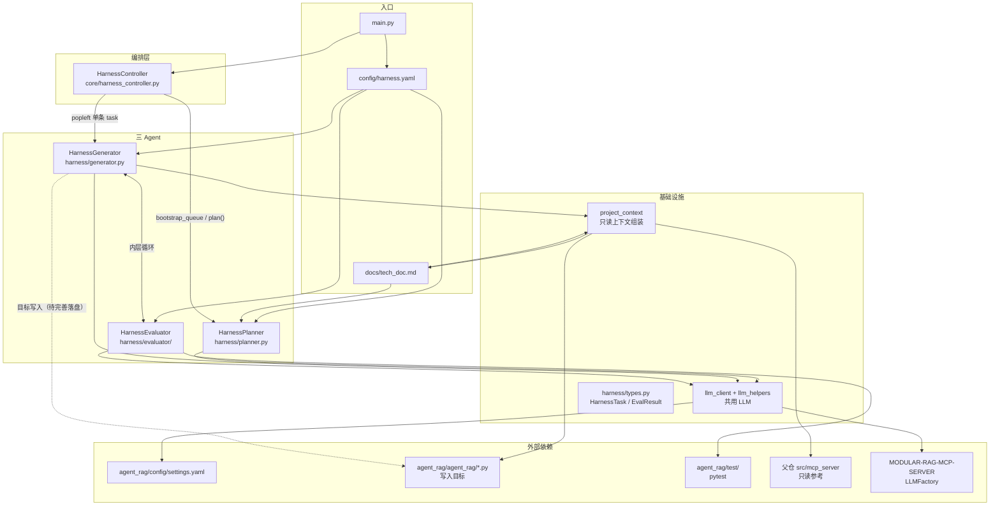
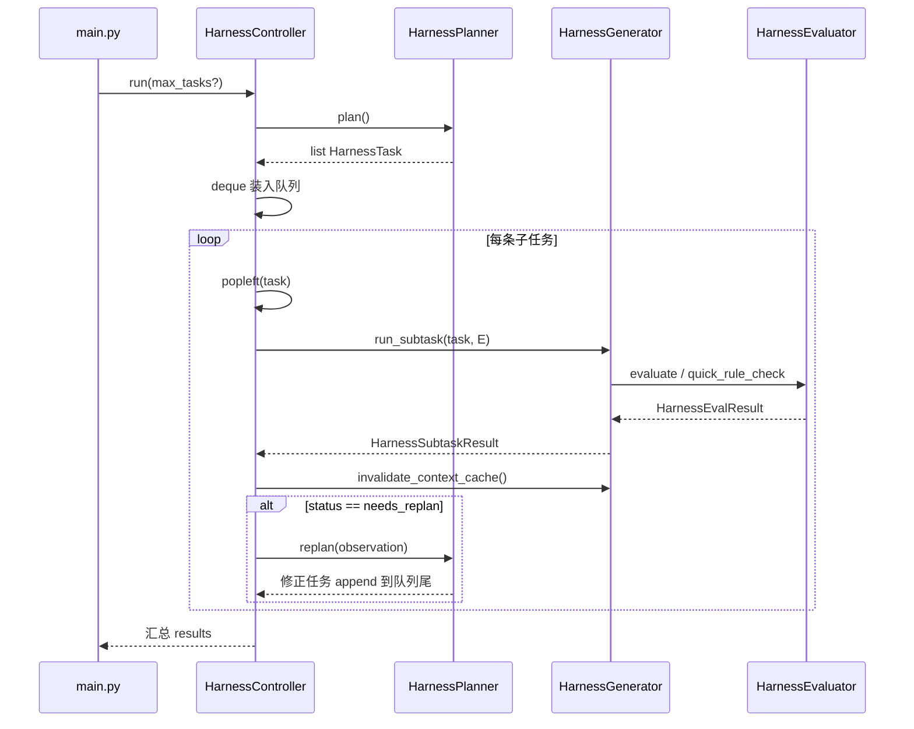
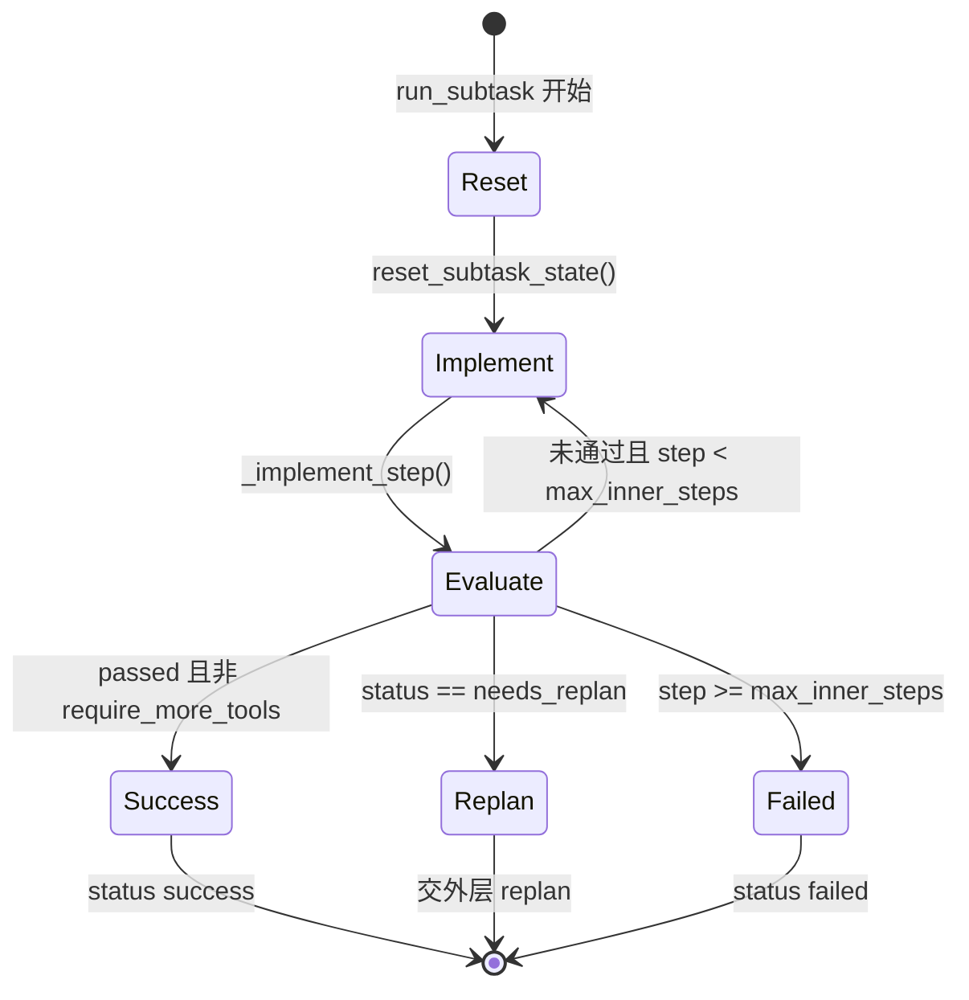
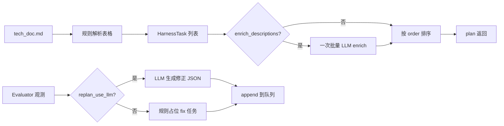
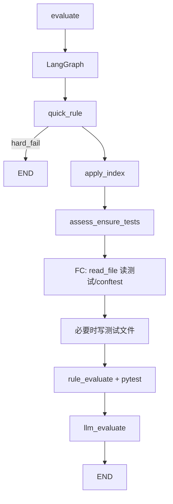
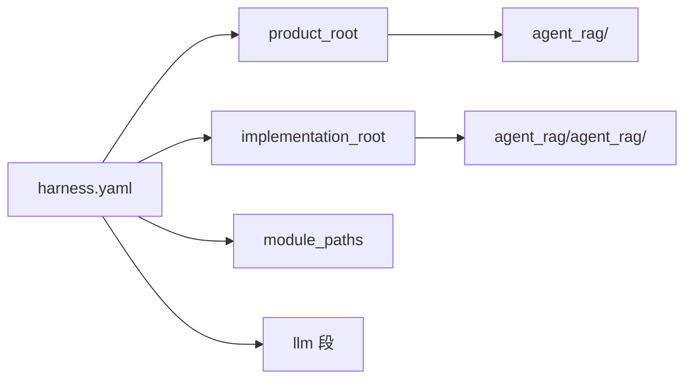

# Harness 整体架构

本文档描述 **meta_harness_rag** 内 **Harness（写代码工具）** 的分层结构、控制流，以及各模块/关键方法的**流程思想**。  
与 RAG 产品（`agent_rag/`）的双系统边界见 [`architecture.md`](architecture.md)；运行命令见 [`harness.md`](harness.md)。

---

## 1. 定位与设计原则

| 原则 | 说明 |
|------|------|
| **只写不跑** | Harness 不回答用户问题，只按 `tech_doc.md` 在 `../agent_rag/agent_rag/` 落地代码 |
| **一次一个函数** | 外层队列每次只向 Generator 投递**一条** `HarnessTask`（一个 symbol） |
| **内外双层循环** | 外层：Planner → 单任务 → 下一条；内层：Generator ↔ Evaluator 直到通过或失败 |
| **子任务无状态** | 每条子任务结束后 `reset_subtask_state()`，不携带上一任务的草稿/轨迹 |
| **规则 + LLM** | 队列解析、pytest 以**规则**为主（可复现）；描述 enrich、实现草稿、终判可接 **LLM** |
| **与产品隔离** | `harness/` 不 import `agent_rag` 业务；`agent_rag` 不 import `harness` |

---

## 2. 系统架构图

**数据流一句话**：`tech_doc` → Planner 产出有序 `HarnessTask` 队列 → Controller 逐条交给 Generator → Generator 在只读上下文中让 LLM 写草稿 → Evaluator 用 pytest + 规则 + LLM 判是否完成 → 失败可 `replan` 追加修正任务。

---

## 3. 双层控制流

### 3.1 外层循环（HarnessController）

| 方法 | 流程思想 |
|------|----------|
| `bootstrap_queue()` | 调用 `planner.plan()` 一次性生成全队列，装入 `deque`；Planner 内部 `_index` 置末，避免与 `get_next_task()` 重复消费 |
| `run()` | **串行**消费队列：严格「一条任务 → 一整段子任务内循环 → 再下一条」；`max_tasks` 用于调试截断 |
| `_log()` | 可选控制台轨迹，便于观察 Planner 传单、子任务终态、replan |

### 3.2 内层循环（Generator ↔ Evaluator）

| 方法 | 流程思想 |
|------|----------|
| `run_subtask()` | 内层 **while**（未来可换 LangGraph）：每步「实现 → 评估」，最多 `max_inner_steps`（默认 8） |
| `reset_subtask_state()` | 清空 `_inner_trace`、`_scratch_messages`、`_step_count`；成功或耗尽步数后再次清空，保证**无跨任务记忆** |
| `_implement_step()` | 组装 prompt：子任务元数据 + 上轮 `issues` + `build_project_context()`；LLM 输出 diff/代码块（**落盘步骤待接**） |
| `invalidate_context_cache()` | 子任务结束后由 Controller 调用，使下一任务能读到**最新** `agent_rag` 代码树 |

---

## 4. 三 Agent 分模块说明

### 4.1 HarnessPlanner（任务规划）

**职责**：把 `tech_doc.md` 变成可执行的、有序的 `HarnessTask` 列表；失败时产出修正任务。

| 方法 | 流程思想 |
|------|----------|
| `plan()` | **稳定可复现**的核心：正则扫 § 表格行 → 构造 `id/module/symbol/target_file`；**不写 `test_file`**（由 Evaluator `apply_index_to_task` 读 `TEST_INDEX.md`）；可选 `_llm_enrich_tasks_batch()` |
| `_parse_section_tasks()` | 按 `## N.` 章节 + 表格行生成子任务；`target_file` 来自 `harness.yaml` 的 `module_paths` |
| `_parse_02_memory()` | 优先解析 §0.2 中 §1 MemoryManager 表格（与 §0.1 单函数顺序对齐） |
| `_llm_enrich_tasks_batch()` | 将最多 `enrich_max_tasks` 条任务摘要 + tech_doc 节选送入 LLM；按 `id` 合并回队列 |
| `get_next_task()` | 独立使用 Planner 时的游标消费；**Controller 走 deque 时不依赖此方法** |
| `replan(observation)` | 内层返回 `needs_replan` 时，根据观测生成**一条**修正任务（`replan-*` id），追加到 `_queue` 供 Controller 后续执行 |

**HarnessTask 关键字段**（见 `harness/types.py`）：

| 字段 | 含义 |
|------|------|
| `id` | 如 `1.1`，对应 tech_doc 表格序号 |
| `symbol` | 待实现的函数/方法名 |
| `target_file` | 相对 `meta_harness_rag` 包根的路径，如 `../agent_rag/agent_rag/memory/memory_manager.py` |
| `test_file` | 相对 `agent_rag` 产品根的 pytest 路径；**仅 Evaluator** 根据 `TEST_INDEX.md` 写入（Planner/门禁任务构造时不填） |
| `done_criteria` | 完成标准（可经 LLM enrich） |

---

### 4.2 HarnessGenerator（实现生成）

**职责**：在**单个子任务**范围内，反复产出实现草稿，直到 Evaluator 认可或触发 replan/失败。

| 方法 | 流程思想 |
|------|----------|
| `_get_project_context()` | 懒加载缓存；内容 = tech_doc 全文 + 多棵只读代码树（`agent_rag/agent_rag` + `src/mcp_server`） |
| `_format_trace()` | 把内层步骤压成短摘要，供 Evaluator 的 `tool_trace_summary` |
| `_implement_step()` | **单步实现**：读 Evaluator 上轮 `issues` 迭代修正；无 LLM 时返回 `[stub]` 占位，便于先跑通管线 |

**只读上下文**（`project_context.build_project_context`）：

| 步骤 | 思想 |
|------|------|
| `resolve_read_only_roots()` | 从 `harness.yaml` 解析实现根、MCP Server 路径；**永不**扫描 `harness/` |
| `_snapshot_tree()` | 按目录列举 `.py`，单文件与整树均有字符上限，防止 prompt 爆炸 |
| 写入边界 | 设计上仅允许改 `implementation_root`；当前代码以 LLM **草稿** 为主，**文件落盘**为后续接线点 |

---

### 4.3 HarnessEvaluator（质量门禁 · LangGraph + Function Calling）

**职责**：对当前子任务的产出做可自动化检查，并用 LLM 终判。代码在 **`harness/evaluator/`** 子包：LangGraph 见 `graph.py`，节点逻辑在 `runtime.py`。

**Function calling**（`harness/evaluator/function_calling.py`）：

| 模式 | 配置 | 行为 |
|------|------|------|
| **custom_http**（默认） | `evaluator.llm_transport: custom_http` + `settings.yaml` 的 `llm.base_url` | Harness 直连完整 endpoint（同 **CustomLLM**），请求体带原生 `tools`，解析 `tool_calls` |
| **回退** | `fc_fallback_json: true` 且 HTTP 失败 | JSON 协议 + `LLMFactory.chat` |
| **factory** | `llm_transport: factory` | 仅 JSON 协议 + Factory |

文件工具沙箱：`harness/evaluator/tools.py`（`read_file` / `list_dir` / `grep_in_file`）。

| 模块 | 作用 |
|------|------|
| `evaluator/agent.py` | 对外 `HarnessEvaluator` 门面 |
| `evaluator/graph.py` | `StateGraph` 编译与 `invoke` |
| `evaluator/runtime.py` | 各节点实现、pytest、写测试、索引同步 |
| `evaluator/state.py` | `EvaluatorState` TypedDict |
| `evaluator/function_calling.py` | 原生 tools + JSON 回退 |

| 节点 | 流程思想 |
|------|----------|
| `quick_rule` | 轨迹 `[error]` 连续达阈值 → `hard_fail` |
| `apply_index` | 从 `TEST_INDEX.md` 解析 `test_file` |
| `assess_ensure_tests` | FC 读测试判断完备性；不全则写/改测试并同步索引 |
| `rule_evaluate` | pytest：unit 为单文件；**`gate.*`** 为目录或 `-m` marker（`harness/gates.py`） |
| `llm_evaluate` | 结合 pytest 与轨迹终判 JSON（含 `progress` / `progress_note`，供写 TEST_PROGRESS） |
| `update_test_progress` | 将 LLM 的 `progress` 写入 `test/TEST_PROGRESS.md` 对应行 |

配置（`harness.yaml` → `evaluator`）：`use_langgraph`、`use_function_calling`、`fc_max_rounds`；正文长度键（如 `fc_read_file_max_chars`、`test_index_catalog_max_chars`、`prompt_draft_max_chars` 等）**为 0 或省略时不截断**。

**HarnessEvalResult.status 语义**：

| status | 含义 | 外层行为 |
|--------|------|----------|
| `ok` | 继续内层迭代或已通过 | Generator 继续或成功结束 |
| `needs_replan` | 规格/计划可能有问题 | Controller 调用 `planner.replan()` |
| `hard_fail` | 不可恢复错误 | 子任务失败，一般不 replan |

---

## 5. 基础设施模块

| 模块 | 作用 | 流程思想 |
|------|------|----------|
| `harness/config_loader.py` | `load_harness_config()`、`resolve_product_root()` | Harness 与 RAG 配置分文件；pytest/路径解析统一到 `../agent_rag` |
| `harness/llm_config.py` | `HarnessLLMConfig` | 仅读 `harness.yaml` 的 `llm` 段 |
| `harness/llm_client.py` | `create_harness_llm()` | `HarnessLLMConfig` → `LLMFactory`；三 Agent **共用** |
| `harness/llm_http.py` | `HarnessCustomHttp` | Evaluator FC；同 `llm` 段的 `base_url`（Custom 语义） |
| `harness/llm_helpers.py` | `chat()`、`parse_json_*` | 按 `planner`/`generator`/`evaluator` 段覆盖 `temperature`/`max_tokens` |
| `harness/types.py` | TypedDict | Harness 专用类型，**勿**与 tech_doc §6 产品侧 `SubtaskResult` 混用 |

---

## 6. 配置与入口映射

| `harness.yaml` 键 | 影响 |
|-------------------|------|
| `planner.enrich_descriptions` | `plan()` 是否调用批量 LLM enrich |
| `planner.replan_use_llm` | `replan()` 是否用 LLM 生成修正任务 |
| `generator.max_inner_steps` | 内层循环上限 |
| `evaluator.use_llm` | 是否在规则/pytest 后再做 LLM 终判 |
| `mcp_server_code_path` | Generator 只读快照中的 MCP Server 源码 |

**入口**（`main.py`）：

1. `load_harness_config()`  
2. `create_harness_llm()` → 注入三个 Agent  
3. `--dry-plan`：仅 `planner.plan()` 打印队列  
4. 否则：`HarnessController(planner, generator, evaluator).run()`

---

## 7. 与 RAG 产品 Agent 的命名对照

| 概念 | Harness（写代码） | RAG 产品（运行时） |
|------|-------------------|-------------------|
| 规划 | `HarnessPlanner` | `PlannerAgent` |
| 实现 | `HarnessGenerator` | `Generator` |
| 评估 | `HarnessEvaluator` | `Evaluator` |
| 编排 | `HarnessController` | `RagOrchestrator` |

同名不同类、不同包路径，**禁止**互相 import。

---

## 8. 演进方向（文档与代码对齐）

| 项 | 现状 | 目标 |
|----|------|------|
| 内层编排 | `while` 循环 | 可替换为 LangGraph 子图（Gen↔Eval） |
| 代码落盘 | LLM 返回草稿文本 | 解析 diff/代码块 → 写入 `task.target_file` |
| Planner 解析 | 以 §0.2 / 表格为主 | 扩展覆盖 tech_doc 全部 §1–§7 章节 |
| MCP 工具调用 | 轨迹字段预留 | 与 MCP JSON-RPC 执行层对接（表/图扩窗） |

---

## 9. 相关文档

- [`architecture.md`](architecture.md) — Harness vs `agent_rag` 双系统  
- [`harness.md`](harness.md) — 运行命令与配置速查  
- [`tech_doc.md`](tech_doc.md) — RAG 产品接口规格（Harness 的实现依据）  
- [`../agent_rag/README.md`](../../agent_rag/README.md) — 产品包与测试入口  
